# PlantUML Templates

## 1. Class diagram

```plantuml
@startuml
title <Scope> - class diagram

' Scope: <scope>
' Evidence:
' - <file>
' Assumptions:
' - <assumption>

package "<package>" {
  interface <InterfaceName>
  class <ClassName>
  enum <EnumName>
}

<InterfaceName> <|.. <ClassName>
<ClassName> --> <DependencyName> : uses

@enduml
```

## 2. Object diagram

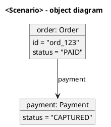

## 3. Package diagram

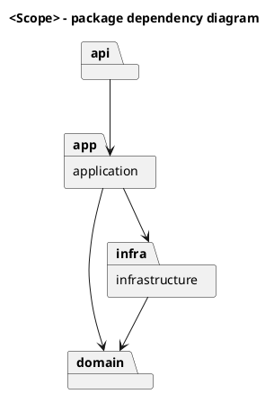

## 4. Component diagram

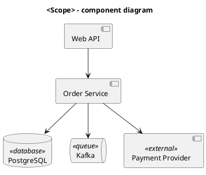

## 5. Deployment diagram

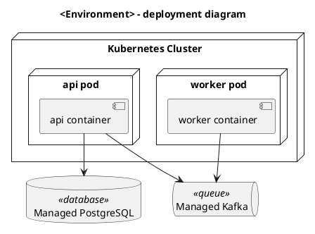

## 6. Composite structure diagram approximation

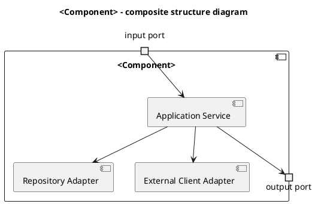

## 7. Profile diagram approximation

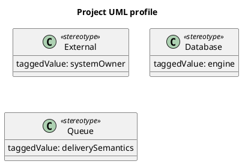

## 8. Use case diagram

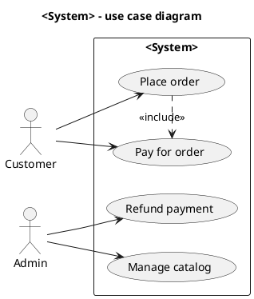

## 9. Activity diagram

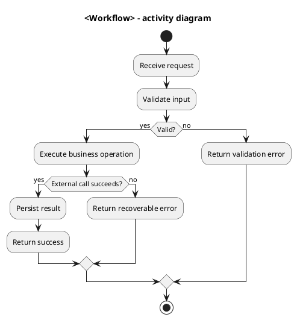

## 10. State machine diagram

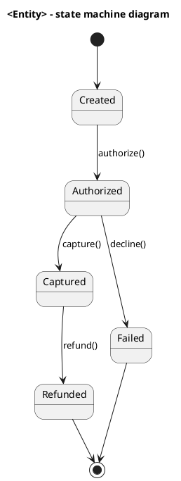

## 11. Sequence diagram

```plantuml
@startuml
title <Use case> - sequence diagram

' Scope: <scope>
' Evidence:
' - <file>

actor User
participant "Controller" as Controller
participant "Service" as Service
database "Database" as DB
component "External API" <<external>> as External

User -> Controller: request
Controller -> Service: execute(command)
Service -> DB: load data
Service -> External: call API

alt success
  External --> Service: ok
  Service -> DB: save result
  Service --> Controller: success
else failure
  External --> Service: error
  Service --> Controller: failure
end

Controller --> User: response

@enduml
```

## 12. Communication diagram approximation

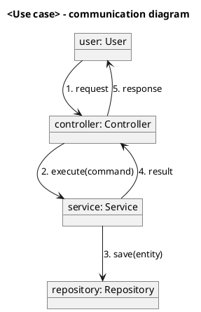

## 13. Interaction overview diagram approximation

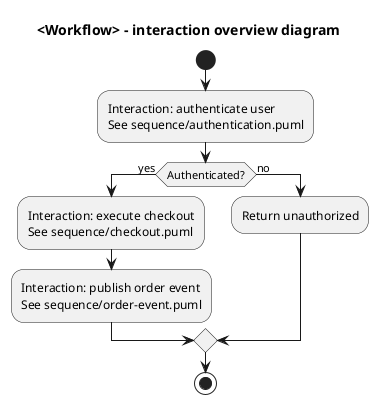

## 14. Timing diagram

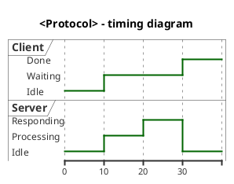

## 15. ERD / database schema diagram

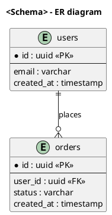

## 16. C4 diagram approximation

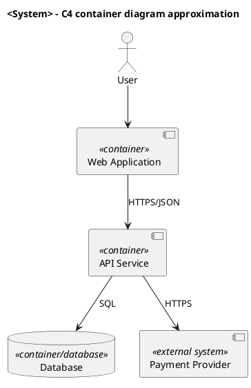

## 17. DFD approximation

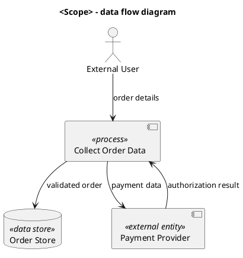

## 18. Flowchart

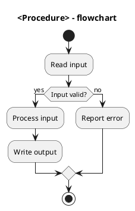

## 19. API dependency diagram

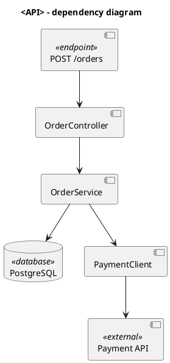

## 20. Event flow diagram

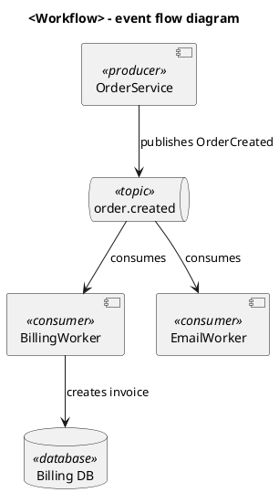

## 21. Domain model diagram

```plantuml
@startuml
title <Bounded Context> - domain model diagram

' Scope: <scope>
' Evidence:
' - <file>

package "<Bounded Context>" <<bounded-context>> {
  class Order <<aggregate-root>>
  class OrderLine <<entity>>
  class Money <<value-object>>
  class OrderRepository <<repository>>
  class OrderPlaced <<domain-event>>
}

Order *-- OrderLine
Order *-- Money
OrderRepository --> Order
Order --> OrderPlaced : raises

@enduml
```

## 22. DDD context map

```plantuml
@startuml
title <System> - DDD context map

' Scope: <scope>
' Evidence:
' - <file>

component "Ordering" <<bounded-context>> as Ordering
component "Billing" <<bounded-context>> as Billing
component "Shipping" <<bounded-context>> as Shipping
component "Legacy ERP" <<external>> as ERP
component "Anti-Corruption Layer" <<ACL>> as ACL

Ordering --> Billing : customer/supplier
Ordering --> Shipping : published language
Billing --> ACL
ACL --> ERP

@enduml
```
